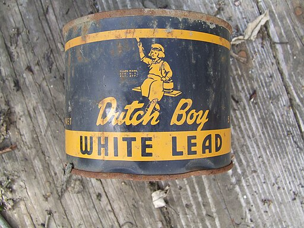

# Welcome to the ECLIPS Project Landing Site 

Lead pollution is a global problem, toxic even in small amounts. It persists in our environment due to past use in paint, petrol, and plumbing, contaminating our air, water, soil, dust, and food. Children are particularly vulnerable to lead's harmful effects because of their developing brains. Lead exposure is preventable.

With the support of a [UKRI CRCRM award](https://www.ukri.org/news/first-projects-from-ukris-new-interdisciplinary-scheme-announced/), the ECLIPS Project will develop and test a new child-friendly screening procedure to make home blood sample collection quick, easy, and stress-free. By enabling widespread blood lead monitoring, we can help develop evidence-based policies to reduce children's lead exposure in both community and home environments.

Our interdisciplinary method reimagines biomonitoring as a community science activity: families become integral partners in data collection, working from their own homes and gaining support to identify practical approaches to reduce lead exposure.

## Get in Touch

- 📧 [Email Us](mailto:your@email.com)
- 🐙 [GitHub](https://github.com/fditraglia/leadprevalence.uk)

---
*Last updated: November 2024*
